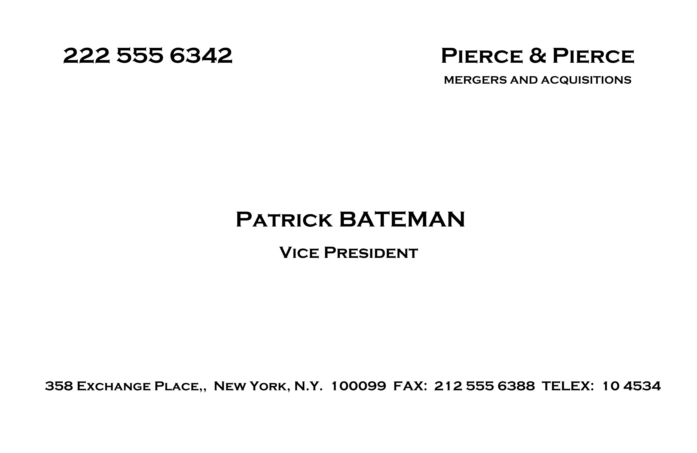
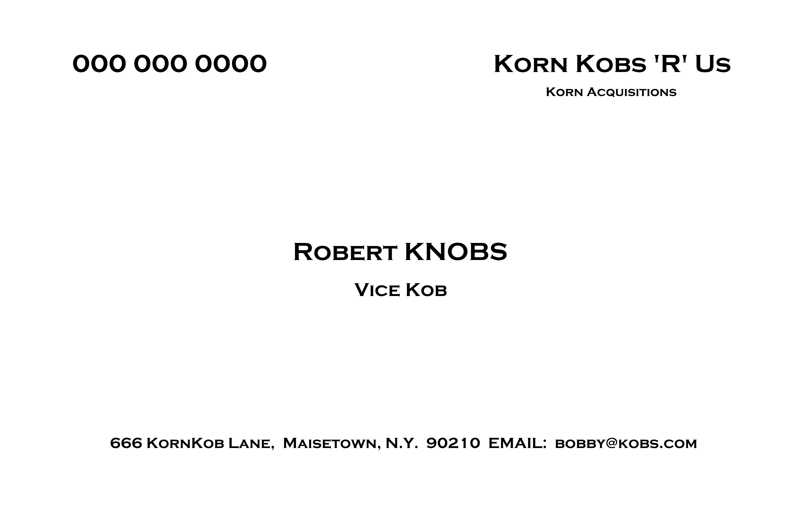

# Create your own business card - just like Patrick Bateman's from American Psycho!

## Description

Make your own version of the card from American Psycho.

will export the results via the save button to a JPG file in your downloads folder

## To Do List
<ol>
<li>Add in some background options</li>
<li>Add in some font options</li>
<li>Add a water mark option!</li>
</ol>

## NOTES

*** IF YOU WANT TO USE LOCALLY, RUN WITH LOCALHOST OR THE FONT WILL NOT LOAD AND BREAK THE PROGRAM! ***

Conversely, if you want to edit the code so it does not rely on a call to loadFont, you can do so if you wish. 
